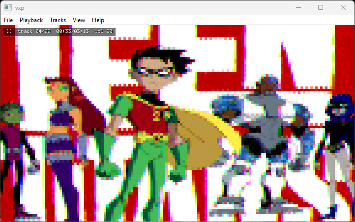
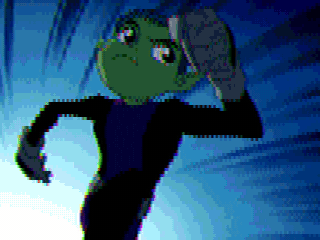
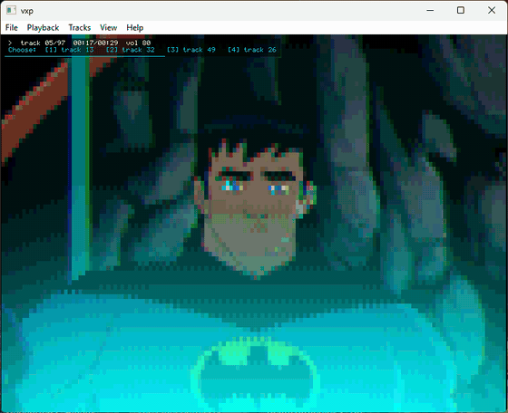

<div align="center">


**Play VideoNow XP discs on your PC.**


<br>



</div>

# vxp

An emulator for the **VideoNow XP**, the Hasbro/Tiger personal video player that read
video off small pressed CDs.

`vxp` mounts a disc image, decodes the picture and sound itself, and plays titles at the
disc's true rate — with a native menu bar, a track browser, rebindable controls, and a
full command line for driving it headlessly.

```
vxp "Some Title.cue"
```

## What it does

- **VideoNow XP and VideoNow Color** discs, detected automatically.
- **Picture** — 144 x 80, three 4-bit channels per pixel, decoded natively and shown at
  the shape the panel showed it rather than the shape it is stored in.
- **Sound** — 8-bit mono, in sync, played at twice CD speed, 35 280 Hz, by default (`--rate` to change).
- **Transport** — play, pause, seek, frame step, variable speed, fast forward, loop.
- **Interactive titles** — the branch table is read out of each segment's header, so
  decision points offer the destinations the disc actually declares. Take a wrong turn
  and you can step back through the segments you came from.
- **Menus** — a real application menu bar on Windows, plus an in-window menu that works
  everywhere. Settings, a track browser and control rebinding are in both.
- **Headless CLI** — inspect, verify, export, graph the branch structure, and drive
  scripted playback with no window at all.

<div align="center">


<em>Teen Titans · Batman vs The Joker · Jimmy Neutron<br>
Codename: Kids Next Door · My Life as a Teenage Robot (two titles)</em>

</div>

## The disc is not a video file

A VideoNow disc is a physically small CD pressed as an **ordinary audio CD**: no
filesystem, no container, no standard codec. The player reads raw 2352-byte CD-DA sectors
and feeds them almost straight to an LCD controller and a DAC, so there is nothing here for
a general-purpose media library to open. Decoding it is a few hundred lines, and `Vxp.Core`
is those lines.

Everything else falls out of that one fact:

- The stream is interleaved **nine video bytes to one audio byte**. A CD reads 176 400
  bytes a second, so the audio is 17 640 Hz — a tenth of the disc — and that is why.
- Frames are a fixed size on disc, 19 760 bytes on XP and 19 600 on Color, both carrying
  the same 144 x 80 picture. The frame rate is not stored anywhere; it is
  `176 400 / 19 760` = **8.9271 fps**, arithmetic rather than metadata.
- Which variant a disc is comes from **counting sync-word repeats** in the frame header:
  24 means Color, 12 means XP.
- That 144 x 80 is the shape of the *storage*, not of the picture. The panel's pixels are
  appreciably taller than they are wide, so a frame drawn with square pixels comes out
  about a third too wide; `vxp` puts it back at 4:3, which is what the titles were shot
  at. The larger resolutions quoted elsewhere — 216 x 160, 240 x 160 — are counting 4-bit
  colour samples rather than pixels, or are uncited; `docs/format.md` works through both.
- Audio is therefore the honest master clock, and playback is clocked by it — the player
  decodes exactly as many frames as the sound card consumes, so picture and sound cannot
  drift apart. A headless run is the same loop with no sound card, which is what makes
  scripted playback deterministic.
- Interactive titles are not a separate feature of the player. Branches are cut as
  ordinary tracks and the destinations are declared in each segment's header, so following
  a story is reading the disc rather than guessing at it.

<div align="center">



<em>A title sequence coming off the disc: 144 x 80 pixels, three 4-bit<br>
channels each, 8.93 frames a second, and not a codec in sight.</em>

</div>

## Requirements

- [.NET SDK 8.0 or later](https://dotnet.microsoft.com/download)
- SDL2, which arrives through NuGet on Windows, macOS and Linux

Tagged releases carry a Windows build, `vxp-windows-x86_64.zip`, that needs neither: it is a
self-contained `vxp.exe` with `SDL2.dll` beside it. Pushing a `v*` tag that matches
`<Version>` in `src/Vxp/Vxp.csproj` builds and publishes it.

## Building

```sh
dotnet build -c Release
dotnet test
```

The binary lands in `src/Vxp/bin/Release/net8.0/`.

## Discs

`vxp` reads the cue-sheet-plus-binary images that CD ripping tools produce, in either the
one-file-per-track or single-file layout. Point it at the `.cue`, or at a `.zip` holding
the cue sheet and its tracks, the way Redump sets are distributed.

A zip is read in place and never modified. Tracks are decompressed only as far as playback
reaches, into temporary files that are deleted when `vxp` exits (or is killed), and the
rest of the disc is decompressed in the background so a branch never waits on the archive.

No disc images are included in this repository, and none are needed to build or test it.

## Playing

```
vxp <disc.cue|disc.zip> [options]
```

| Option | Effect |
|--------|--------|
| `--track N` | Start on this track |
| `--frame N` | Start at this frame of that track |
| `--scale N` | Window scale factor |
| `--fullscreen` / `--windowed` | Override the saved window mode |
| `--speed N` | Playback rate as a percentage, 25 to 800 |
| `--rate HZ` | Disc sample rate, 16000 to 40000 (default 35280) |
| `--volume N` | Volume, 0 to 100 |
| `--mute` | Start silent |
| `--loop MODE` | `none`, `track` or `disc` |
| `--navigation MODE` | `discOrder` or `followHeader` |
| `--choice-timeout MODE` | `firstBranch`, `discOrder` or `wait` |
| `--no-config` | Ignore the settings file and use defaults; nothing is saved |

Run `vxp` with no disc — or double-click `vxp.exe` — and the player opens empty. Open a
disc from there, or swap to another while one is playing, with **Ctrl + O** (File > Open
Disc), the menu's **Recent discs**, or by dropping a `.cue`, `.zip` or `.bin` on the
window. **Ctrl + W** ejects back to the empty player. A file that will not open says why in
the window and leaves whatever was playing alone.

Options may come before or after the disc path. They override the saved settings for that
run without changing what is stored: a launcher that always passes `--fullscreen` leaves a
later windowed run windowed. An overridden setting the viewer then changes in the menus is
saved as they left it.

### Default controls

Every one of these can be rebound, to the keyboard or to a game controller.

| Key | Action |
|-----|--------|
| Space | Play / pause |
| Left / Right | Previous / next track |
| Shift + Left / Right | Seek back / forward |
| `,` / `.` | Step one frame back / forward |
| F (hold) | Fast forward |
| `-` / `=` / `0` | Slower / faster / normal speed |
| B | Back a segment |
| L | Cycle loop mode |
| 1 - 6 | Take a branch at a decision point |
| Up / Down | Volume |
| M | Mute |
| Escape | Open the menu (and back out of it) |
| T | Track browser |
| Tab | Cycle the status overlay |
| F11 | Full screen |
| F12 | Screenshot |
| Backspace | Stop and rewind |
| Ctrl + O | Open a disc |
| Ctrl + W | Close the disc |
| Ctrl + Q | Quit |

| Controller | Action |
|------------|--------|
| A | Play / pause |
| B | Stop and rewind |
| D-pad up / right / down / left | Take branch 1 / 2 / 3 / 4 |
| X / Y | Take branch 5 / 6 |
| LB / RB | Previous / next track |
| RT (hold) | Fast forward |
| Start | Open the menu |
| Back | Track browser |
| Guide | Quit |

A control can mean two things without conflict: the arrow keys and the D-pad work the
player during playback and move the highlight once a menu is open.

The first connected SDL game controller is used. Extra controller mappings can be loaded
with SDL's own `SDL_GAMECONTROLLERCONFIG_FILE` environment variable. Full screen hides the
mouse pointer.

### Menus and settings

On Windows there is an ordinary application menu bar — **File**, **Playback**, **Tracks**,
**View**, **Help** — opened with the mouse, Alt or F10, and playback carries on while a
menu is up rather than freezing behind it. Escape opens the same pages drawn inside the
picture instead; that one is what full screen, game controllers and the other platforms
use, and it is the only place a control can be rebound, a menu bar having nowhere to catch
a keypress. Both are built from one description of the pages, so a setting cannot appear
differently in the two of them. `interface.nativeMenuBar` turns the bar off.

What there is to change:

- **Picture** — scaling mode, filtering, window scale, pixel aspect, brightness, contrast,
  saturation, gamma, channel order, and a simulated LCD grid and scanlines.
- **Sound** — volume, mute, output buffer depth, and whether sound keeps playing when the
  window loses focus.
- **Playback** — speed, fast-forward rate, seek step, loop mode, play on load, skipping
  empty tracks, and how interactive choices behave.
- **On-screen display** — overlay mode, corner, timeout and text size, and whether the
  overlay carries the track and time, the branch choices, and the frame rate.
- **Controls** — every action rebindable, to the keyboard or to a game controller. Enter
  captures the next control pressed, Left clears a binding, Delete restores the default;
  conflicts are reported rather than silently overwritten.
- **Tracks** — every segment with its running time, branch structure and a jump-to.
- **Disc information** — format, timing, and whether the title is interactive.

Settings save as you change them, and every one of them is also readable and writable from
the shell — see [Settings from the command line](#settings-from-the-command-line).

### Interactive titles

Branches are cut as ordinary tracks, and each segment's header declares where it can go.
At a decision point `vxp` reads that table out of the disc and offers exactly the
destinations it names:

<div align="center">



<em>Reaching a choice point on Batman vs The Joker. The four destinations<br>
are read from the segment header, not guessed at.</em>

</div>

## Inspecting a disc

```
vxp info    <disc.cue> [--json]              Format, timing and the track list
vxp tracks  <disc.cue> [--playable] [--json] Just the track list
vxp map     <disc.cue> [--json]              Segment kinds and the branch table
vxp graph   <disc.cue> [--format dot|mermaid|json] [--out FILE]
vxp headers <disc.cue> [--track N] [--frames N] [--all]
vxp verify  <disc.cue> [--deep] [--json]     Check the disc reads back cleanly
```

`vxp graph` writes the branch structure of an interactive title as a graph:

```sh
vxp graph "Some Title.cue" --format dot | dot -Tpng -o story.png
```

## Exporting

```
vxp export <disc.cue> --out DIR [--track N] [--start N] [--frames N]
                                [--every N] [--scale N] [--no-audio] [--no-video]
vxp frame  <disc.cue> --track N [--frame N] --out FILE.png [--scale N]
vxp audio  <disc.cue> --out FILE.wav [--track N]
```

`export` and `frame` also accept `--brightness`, `--contrast`, `--gamma`, `--saturation`
and `--swizzle`.

```sh
vxp export "Some Title.cue" --track 2 --out frames
```

## Driving it headlessly

`vxp run` executes the emulator with no window, as fast as it decodes. Because playback is
clocked by the audio the player generates, a headless run is the same loop without a sound
card, which makes scripted runs deterministic.

```sh
vxp run "Some Title.cue" --commands "track 6; choice 2; play track; expect track 32"
```

| Option | Effect |
|--------|--------|
| `--script FILE` | Read commands from a file, or `-` for standard input |
| `--commands "a; b; c"` | Commands inline |
| `--wav FILE` | Record the session soundtrack |
| `--frames-out DIR` | Write every decoded frame as a PNG |
| `--max-frames N` | Stop writing frames after N |
| `--max-seconds N` | Ceiling on `play all` and `play track`, in disc seconds. Default 3600 |
| `--json` | Machine-readable `status` output |

Script commands, one per line or separated by semicolons, with `#` for comments:

| Command | Meaning |
|---------|---------|
| `track N` | Jump to a track |
| `play [5s\|90f\|track\|all]` | Play for a duration, to the end of the track, or to the end |
| `pause` / `resume` / `stop` | Transport |
| `next` / `prev` / `back` | Segment navigation |
| `seek 5s` / `seek -2s` / `frame N` | Move within a track |
| `step [N]` | Step frames and pause |
| `speed 2.0` | Playback rate |
| `choice N` | Queue a branch for the end of the segment |
| `choose N` | Take a branch immediately |
| `screenshot FILE` | Write a PNG |
| `status` | Print the player state |
| `expect FIELD VALUE` | Check `track`, `frame`, `state`, `kind` or `choices` |
| `echo TEXT` | Print a line |

A failed `expect` sets the exit code, so a script doubles as a regression test for a disc.

## Settings from the command line

Every setting the menus expose is readable and writable from the shell.

```sh
vxp config list [filter] [--json]
vxp config get <setting> [--json]
vxp config set <setting> <value>
vxp config reset [<setting>|all]
vxp config recent [clear]
vxp config path

vxp bind list [--json]
vxp bind set <action> <control>      # vxp bind set TogglePause Space
vxp bind add <action> <control>      # vxp bind add TogglePause Pad:A
vxp bind clear <action>
vxp bind reset [<action>|all]
vxp bind keys                        # every bindable key name
```

Controls are written as `Space`, `Ctrl+Q`, `Shift+Left`, `F11`, `Pad:A`, `Pad:DPadUp` or
`Pad:LeftTrigger+`.

Settings live in `%APPDATA%\vxp` on Windows and `~/.config/vxp` elsewhere; `VXP_CONFIG_DIR`
overrides that. Set `VXP_TRACE_INPUT=1` to log raw input events, which is useful when a
binding is not doing what you expect, or `VXP_TRACE_MENU=1` to log the window messages
behind the native menu bar.

## How it works

```
src/Vxp.Core        Disc mounting, format detection, decoders, player state machine
  Discs/            Cue sheet parsing and track-level disc access
  Format/           Interleaving, frame layout, video and audio decode, header parsing
  Emulation/        Transport, timing, interactive branch logic, disc survey
src/Vxp             The vxp binary
  Cli/              Subcommands and the headless session driver
  Config/           Settings model and storage
  Input/            Actions, bindings and input routing
  Ui/               Bitmap font, drawing surface, menus, status overlay
    Native/         The same menu pages rendered as a Windows menu bar
  Video/            Picture adjustment, PNG and WAV writers
tests/              Vxp.Core.Tests and Vxp.App.Tests
```

`Vxp.Core` has no dependencies beyond the base class library and no reference to SDL, so
it can be reused headlessly. The SDL front end is a host: it pulls PCM, puts pixels on
screen and routes input, and holds no emulation logic of its own.

The disc format, including the register map and the branch table, is written up in
[docs/format.md](docs/format.md) — along with an explicit list of what is confirmed and
what is still guesswork.

## Status

Playback, sound, transport, menus and the command line are solid. The interactive model is
good enough to navigate retail interactive titles, but parts of the segment header are
still being worked out; `docs/format.md` says which. Black and white VideoNow discs are
detected but not yet decoded.

## Credits

Builds on [PVDTools](https://github.com/saramibreak/PVDTools) by saramibreak, which
established the sync word, the frame sizes and the pixel layout for the Color and XP
formats.

## Licence

MIT. See [LICENSE](LICENSE).

VideoNow is a trademark of Hasbro. This project is not affiliated with or endorsed by
Hasbro or Tiger Electronics.
